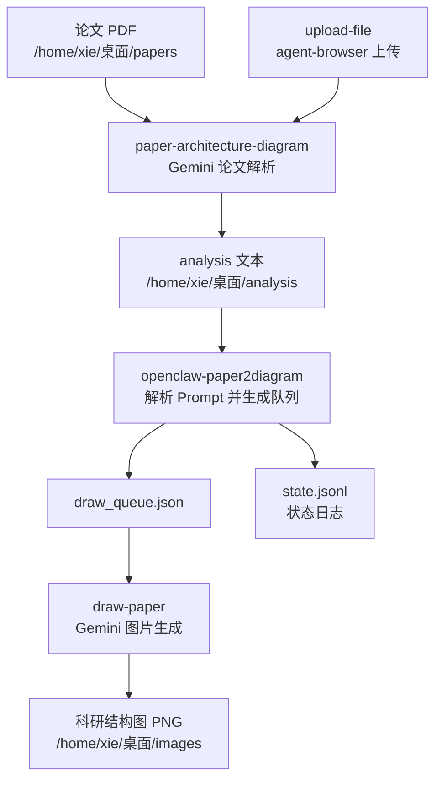

# OpenClaw Paper2Diagram 部署与架构说明

本文档说明 `paper2diagram-mcp` 的整体架构、部署方式、运行流程和常见维护点。该项目用于让 OpenClaw/Codex 通过 MCP 或 `agent-browser` 控制浏览器，完成“论文 PDF -> Gemini 结构解析 -> 绘图 Prompt -> 生成科研结构图”的自动化流程。

## 目录结构

```text
paper2diagram-mcp/
├── paper-architecture-diagram-1.0.0/
│   ├── SKILL.md
│   ├── config.yaml
│   └── _meta.json
├── upload-file-1.0.0/
│   ├── SKILL.md
│   ├── scripts/
│   │   └── upload.py
│   └── _meta.json
├── draw-paper-1.0.0/
│   ├── SKILL.md
│   └── _meta.json
├── openclaw-paper2diagram-1.0.0/
│   ├── SKILL.md
│   └── scripts/
│       └── paper2diagram_flow.py
└── DEPLOYMENT_ARCHITECTURE.md
```

## 模块职责

### `paper-architecture-diagram-1.0.0`

负责论文解析阶段。

- 打开 Gemini。
- 上传论文 PDF。
- 输入固定结构化提示词。
- 等待 Gemini 分析完成。
- 提取论文架构解析和 Nano Banana/Gemini 绘图 Prompt。
- 将整理结果写入本地 analysis 文本文件。

默认输入输出：

```text
输入：/home/xie/桌面/papers/<paper_name>.pdf
输出：/home/xie/桌面/analysis/<paper_name>.txt
```

### `upload-file-1.0.0`

负责浏览器文件上传。

- 优先使用 `scripts/upload.py`。
- 通过 `agent-browser` 打开页面、触发文件输入、上传文件、截图验证。
- 支持 selector fallback。

命令格式：

```bash
python upload-file-1.0.0/scripts/upload.py <url> <file-path> [selector] [wait_ms]
```

### `draw-paper-1.0.0`

负责绘图阶段。

- 读取 analysis 文本中的每张图 Prompt。
- 打开 Gemini 的图片生成能力。
- 逐张发送 Prompt。
- 等待图片生成完成。
- 下载并保存到 images 目录。

默认输入输出：

```text
输入：/home/xie/桌面/analysis/<paper_name>.txt
输出：/home/xie/桌面/images/<paper_name>/figure_<index>.png
```

### `openclaw-paper2diagram-1.0.0`

新增的总控层，负责把前三个 skill 串成可验证的状态机流程。

它不替代原有 skill，而是承担确定性工作：

- 校验路径。
- 创建输出目录。
- 记录状态日志。
- 从 analysis 文本解析 Prompt。
- 生成绘图队列 `draw_queue.json`。
- 校验图片是否全部生成。

主脚本：

```text
openclaw-paper2diagram-1.0.0/scripts/paper2diagram_flow.py
```

## 总体架构



## 运行环境要求

基础要求：

- Python 3.9 或更高版本。
- OpenClaw/Codex 能访问这些 skill 目录。
- 浏览器 MCP 或 `agent-browser` 可用。
- Gemini 页面可登录并正常使用。
- 本地存在固定工作目录。

推荐目录：

```bash
mkdir -p /home/xie/桌面/papers
mkdir -p /home/xie/桌面/analysis
mkdir -p /home/xie/桌面/images
```

如果不是 Linux 或路径不同，可以通过脚本参数覆盖：

```bash
--papers-dir <papers目录>
--analysis-dir <analysis目录>
--images-dir <images目录>
```

## 部署步骤

### 1. 放置 skill

将四个 skill 文件夹放到 OpenClaw/Codex 可以发现的位置，或保持当前项目目录作为技能包来源：

```text
paper-architecture-diagram-1.0.0
upload-file-1.0.0
draw-paper-1.0.0
openclaw-paper2diagram-1.0.0
```

### 2. 检查 Python 脚本

在项目根目录执行：

```bash
python -m py_compile openclaw-paper2diagram-1.0.0/scripts/paper2diagram_flow.py
python -m py_compile upload-file-1.0.0/scripts/upload.py
```

没有输出通常表示语法检查通过。

### 3. 准备论文

将论文 PDF 放入：

```text
/home/xie/桌面/papers/<paper_name>.pdf
```

注意：调用脚本和 skill 时，`paper_name` 通常不需要带 `.pdf` 后缀。

### 4. 初始化运行目录

```bash
python openclaw-paper2diagram-1.0.0/scripts/paper2diagram_flow.py prepare <paper_name>
```

该命令会：

- 创建 analysis 目录。
- 创建 images 子目录。
- 写入状态日志。
- 检查论文 PDF 是否存在。

### 5. 执行论文解析

使用 `paper-architecture-diagram` skill：

1. 打开 Gemini。
2. 使用 `upload-file` 上传 `/home/xie/桌面/papers/<paper_name>.pdf`。
3. 输入论文结构解析提示词。
4. 等待 Gemini 完成。
5. 将整理后的图名称和 Prompt 写入：

```text
/home/xie/桌面/analysis/<paper_name>.txt
```

推荐 analysis 文件格式：

```text
[图1 总体框架图]
Prompt:
deep learning architecture diagram, ...

[图2 核心模块图]
Prompt:
clean academic style, ...
```

### 6. 生成绘图队列

```bash
python openclaw-paper2diagram-1.0.0/scripts/paper2diagram_flow.py queue <paper_name>
```

输出：

```text
/home/xie/桌面/images/<paper_name>/draw_queue.json
/home/xie/桌面/images/<paper_name>/state.jsonl
```

`draw_queue.json` 示例：

```json
[
  {
    "index": 1,
    "title": "图1 总体框架图",
    "prompt": "deep learning architecture diagram, ...",
    "output_path": "/home/xie/桌面/images/paper_name/figure_1.png"
  }
]
```

### 7. 执行绘图

使用 `draw-paper` skill 或浏览器自动化读取 `draw_queue.json` 中的每个 item：

1. 打开 Gemini 图片生成。
2. 逐条发送 `prompt`。
3. 等待图片生成完成。
4. 保存到对应 `output_path`。
5. 每张图成功后进入下一张。

输出图片命名：

```text
/home/xie/桌面/images/<paper_name>/figure_1.png
/home/xie/桌面/images/<paper_name>/figure_2.png
...
```

### 8. 完成校验

```bash
python openclaw-paper2diagram-1.0.0/scripts/paper2diagram_flow.py verify <paper_name>
```

如果所有图片都存在，状态日志会写入：

```text
STATE: ALL_COMPLETED
```

如果有缺失，状态日志会写入：

```text
STATE: IMAGES_INCOMPLETE
```

并列出缺失图片路径。

## 状态文件

总控脚本会在每个论文图片目录下写入：

```text
/home/xie/桌面/images/<paper_name>/state.jsonl
```

每行是一条 JSON 状态事件，例如：

```json
{"time":"2026-05-14T01:00:00+00:00","state":"PREPARED","paper_path":"/home/xie/桌面/papers/demo.pdf"}
{"time":"2026-05-14T01:01:00+00:00","state":"QUEUE_CREATED","total_images":3}
{"time":"2026-05-14T01:10:00+00:00","state":"ALL_COMPLETED","total_images":3}
```

状态日志用于排查：

- 哪一步开始失败。
- analysis 文件是否缺失。
- Prompt 是否解析成功。
- 哪些图片未生成。

## 推荐完整命令流

```bash
paper_name="demo_paper"

python openclaw-paper2diagram-1.0.0/scripts/paper2diagram_flow.py prepare "$paper_name"

# 使用 paper-architecture-diagram + upload-file 让 Gemini 生成：
# /home/xie/桌面/analysis/${paper_name}.txt

python openclaw-paper2diagram-1.0.0/scripts/paper2diagram_flow.py queue "$paper_name"

# 使用 draw-paper 读取 draw_queue.json 并生成图片

python openclaw-paper2diagram-1.0.0/scripts/paper2diagram_flow.py verify "$paper_name"
```

## 为什么需要总控脚本

原来的三个 skill 已经能表达流程，但它们之间的交接主要靠自然语言约束：

- 论文名是否一致。
- analysis 文件是否真的写入。
- Prompt 是否按格式解析。
- 图片是否全部保存。
- 哪一步失败后是否停止。

总控脚本把这些可确定的部分变成代码，因此更稳定：

- 路径统一。
- 状态可追踪。
- 中间产物可复用。
- 图像任务可队列化。
- 最终完成可以用文件存在性验证。

## 常见问题

### `queue` 报 analysis 文件不存在

检查：

```text
/home/xie/桌面/analysis/<paper_name>.txt
```

是否已由 `paper-architecture-diagram` skill 写入。注意 `paper_name` 不要多带 `.pdf`。

### `queue` 报 no prompt blocks found

说明 analysis 文件格式不符合解析约定。建议使用：

```text
[图1 名称]
Prompt:
具体 prompt

[图2 名称]
Prompt:
具体 prompt
```

### 上传失败

检查：

- `agent-browser` 是否安装并可执行。
- Gemini 页面是否能正常打开。
- PDF 路径是否存在。
- 上传 selector 是否变化。

可以直接测试：

```bash
python upload-file-1.0.0/scripts/upload.py https://gemini.google.com/app /home/xie/桌面/papers/<paper_name>.pdf
```

### 图片不完整

执行：

```bash
python openclaw-paper2diagram-1.0.0/scripts/paper2diagram_flow.py verify <paper_name>
```

查看缺失的 `output_path`，再用 `draw-paper` 针对缺失项继续生成。

## 维护建议

- Gemini 页面按钮、菜单、上传入口变化时，优先维护 `upload-file` 和 `draw-paper` 的浏览器操作步骤。
- Prompt 格式变化时，优先维护 `paper2diagram_flow.py` 中的 `extract_prompt_blocks`。
- 路径变化时，不要改多个 skill，优先用脚本参数或环境变量覆盖。
- 不建议把所有浏览器点击逻辑都硬编码进总控脚本，因为 Gemini UI 变化较频繁，保留 skill 的自然语言适配能力更灵活。

