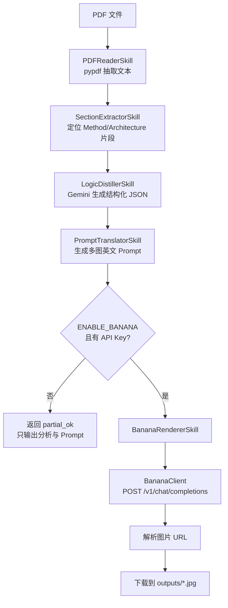
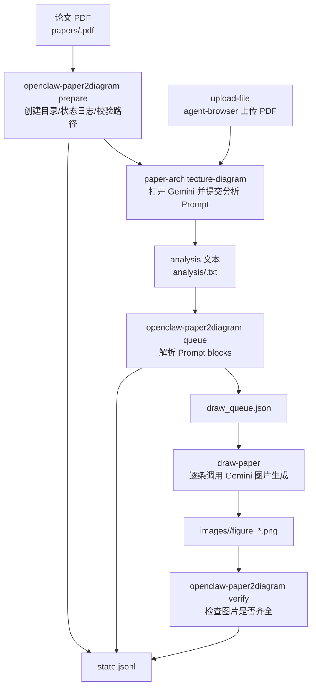

# Paper2Diagram 两套 Skill 部署与架构说明

本文档基于当前工作区内两个目录的实际内容整理：

- `paper2diagram-agent`：通过 OpenClaw 适配层调用本地 Python 流水线，再调用 Gemini 与 Banana/nano-banana API 生成论文结构图。
- `paper2diagram-mcp`：通过 OpenClaw/Codex 的 skill 与 MCP/`agent-browser` 控制浏览器，在 Gemini 页面完成论文上传、结构解析、Prompt 提取和图片生成。

两者目标相同，都是把论文 PDF 转换为可用于汇报、笔记或论文讲解的科研结构图；区别在于执行方式不同。`paper2diagram-agent` 更偏“API 自动化服务”，稳定性取决于网关 API；`paper2diagram-mcp` 更偏“浏览器自动化流程”，稳定性取决于 Gemini 网页、MCP 和 `agent-browser`。

## 1. 总体对比

| 维度 | `paper2diagram-agent` | `paper2diagram-mcp` |
|---|---|---|
| 核心方式 | 本地 Python pipeline + Gemini REST + Banana/nano-banana API | OpenClaw skill + MCP/`agent-browser` 浏览器操作 |
| 输入 | 本地 PDF 绝对路径 | 固定目录中的 PDF，默认 `/home/xie/桌面/papers/<paper_name>.pdf` |
| 中间结果 | pipeline 返回 JSON，包含 `paper_analysis` 与 `final_prompt` | analysis 文本：`/home/xie/桌面/analysis/<paper_name>.txt` |
| 出图方式 | 调用 OpenAI 兼容的 `chat/completions` 图像网关 | 打开 Gemini 图片生成页面，逐条发送 Prompt 并保存 |
| 主要产物 | `outputs/<paper>__fig*.jpg` | `images/<paper_name>/figure_*.png`、`draw_queue.json`、`state.jsonl` |
| 适合场景 | 有稳定 API key、希望脚本化批处理 | 希望复用 Gemini 网页能力，或没有稳定图像 API |
| 主要风险 | API base URL、模型名、鉴权方式、额度、超时 | Gemini UI 变化、上传 selector 变化、浏览器自动化失败 |

## 2. `paper2diagram-agent`

### 2.1 项目定位

`paper2diagram-agent` 是一个本地 Python 项目，同时提供一个 OpenClaw 适配层。它从 PDF 中抽取文本，定位 Method/Architecture 相关片段，调用 Gemini 生成结构化方法描述，再把结构描述翻译成多张英文绘图 Prompt，最后调用 Banana/nano-banana 图像接口生成图片并下载到本地。

它不是纯 prompt 型 skill，而是“skill 说明 + 本地代码执行”的组合：

- `skills/paper2diagram/SKILL.md`：面向 OpenClaw/ClawHub 的技能说明。
- `app/`：真正执行 PDF 解析、LLM 调用、Prompt 生成和出图的 Python 代码。
- `app/openclaw_main.py` 与 `app/openclaw/`：把本地 pipeline 包装成 OpenClaw 可调用的 skill registry。

### 2.2 目录结构

```text
paper2diagram-agent/
├── app/
│   ├── main.py
│   ├── openclaw_main.py
│   ├── config.py
│   ├── clients/
│   │   ├── gemini_client.py
│   │   └── banana_client.py
│   ├── openclaw/
│   │   ├── agent.py
│   │   └── skill_registry.py
│   ├── orchestrator/
│   │   └── pipeline.py
│   ├── prompts/
│   │   ├── agent_role.md
│   │   └── output_schema.md
│   ├── schemas/
│   │   └── common.py
│   └── skills/
│       ├── pdf_reader.py
│       ├── section_extractor.py
│       ├── logic_distiller.py
│       ├── prompt_translator.py
│       └── banana_renderer.py
├── skills/
│   └── paper2diagram/
│       └── SKILL.md
├── outputs/
├── requirements.txt
├── .env.example
├── openclaw.runtime.example.json
└── README.md
```

### 2.3 核心架构



### 2.4 模块职责

| 模块 | 职责 |
|---|---|
| `app/config.py` | 从 `.env` 读取 Gemini 与 Banana 配置，生成 `Settings`。 |
| `app/main.py` | 直接运行 pipeline 的命令行入口。 |
| `app/openclaw_main.py` | OpenClaw 风格入口，支持 `local` 与 `runtime` 两种模式。 |
| `app/openclaw/skill_registry.py` | 注册 `pdf_reader`、`section_extractor`、`logic_distiller`、`prompt_translator`、`banana_renderer`、`paper_to_diagram` 六个 skill handler。 |
| `app/openclaw/agent.py` | OpenClaw runtime 适配壳。当前只做 SDK import 与注册信息打印，实际 SDK 绑定需按 OpenClaw 版本补充。 |
| `app/orchestrator/pipeline.py` | 主流水线，串联所有 skill，并负责下载图像到 `outputs/`。 |
| `app/clients/gemini_client.py` | 调用 Gemini REST `generateContent`，支持官方 `?key=` 与兼容网关 `Bearer`。 |
| `app/clients/banana_client.py` | 调用图像网关的 `POST /v1/chat/completions`，从响应文本中提取图片 URL。 |
| `app/skills/pdf_reader.py` | 用 `pypdf` 读取前 `max_pages` 页文本。 |
| `app/skills/section_extractor.py` | 按关键词抽取方法/架构候选片段，没有命中时用正文前段和中段兜底。 |
| `app/skills/logic_distiller.py` | 用 Gemini 把论文片段提炼成固定字段 JSON。 |
| `app/skills/prompt_translator.py` | 生成 5 张图的 Prompt：背景、主架构、创新点、实验摘要、局限性。 |
| `app/skills/banana_renderer.py` | 包装 BananaClient，接收单个 Prompt 并返回图片生成结果。 |

### 2.5 部署步骤

1. 进入项目目录。

```bash
cd /path/to/paper2diagram-agent
```

2. 创建并激活虚拟环境。

```bash
python3 -m venv .venv
source .venv/bin/activate
```

Windows PowerShell 可使用：

```powershell
python -m venv .venv
.\.venv\Scripts\Activate.ps1
```

3. 安装依赖。

```bash
pip install -r requirements.txt
```

4. 创建 `.env`。

```bash
cp .env.example .env
```

5. 填写关键环境变量。

```bash
GEMINI_API_KEY=your_gemini_or_gateway_api_key
GEMINI_MODEL=gemini-3-pro
GEMINI_BASE_URL=https://generativelanguage.googleapis.com/v1beta
GEMINI_TIMEOUT_SECONDS=180
GEMINI_CONNECT_TIMEOUT_SECONDS=60
GEMINI_USE_QUERY_KEY=false

BANANA_PRO_API_KEY=your_banana_or_gateway_key
BANANA_PRO_BASE_URL=https://your-gateway-host
BANANA_MODEL=nano_banana_pro-1K
BANANA_TIMEOUT_SECONDS=120
ENABLE_BANANA=true
```

注意：当前代码里的 `BananaClient` 实际调用的是：

```text
POST {BANANA_PRO_BASE_URL}/v1/chat/completions
```

因此 `BANANA_PRO_BASE_URL` 通常应填写网关根地址，不要带 `/v1/chat/completions`。`.env.example` 中关于 `/v1/images/generations` 的注释与当前代码不一致，实际以 `app/clients/banana_client.py` 为准。

### 2.6 本地运行

直接运行 pipeline：

```bash
python -m app.main "/absolute/path/to/paper.pdf" 30
```

通过 OpenClaw adapter 的 local 模式运行：

```bash
python -m app.openclaw_main local "/absolute/path/to/paper.pdf" 30
```

参数说明：

- 第一个参数是 PDF 绝对路径。
- 第二个参数是最大读取页数，默认 `30`。

输出包括：

- `status`：`ok`、`partial_ok` 或 `error`。
- `paper_analysis.method_or_architecture_excerpt`：被选中的方法/架构片段摘要。
- `paper_analysis.logic_json_raw`：Gemini 返回的结构化方法 JSON 原文。
- `final_prompt.prompts`：5 张图的英文 Prompt。
- `render_results[]`：每张图的在线 URL、本地保存路径、原始响应等。

当 `ENABLE_BANANA=false` 或缺少 `BANANA_PRO_API_KEY` 时，pipeline 会跳过出图并返回 `partial_ok`，这适合只验证论文解析和 Prompt 生成。

### 2.7 OpenClaw 集成

`openclaw.runtime.example.json` 给出了目标 runtime 映射：

```json
{
  "agent_name": "paper-review-diagram-agent",
  "llm_provider": "gemini",
  "llm_model_env": "GEMINI_MODEL",
  "system_prompt_file": "app/prompts/agent_role.md",
  "output_schema_file": "app/prompts/output_schema.md",
  "tools": [
    "pdf_reader",
    "section_extractor",
    "logic_distiller",
    "prompt_translator",
    "banana_renderer",
    "paper_to_diagram"
  ],
  "tool_dispatcher": "app.openclaw.skill_registry:SkillRegistry.call"
}
```

目前 `app/openclaw/agent.py` 是版本宽松的适配层：`runtime` 模式会尝试 import `openclaw`，打印已注册 skill，但不会自动完成 SDK 注册。真正部署到 OpenClaw runtime 时，需要根据你安装的 OpenClaw SDK API，把 `SkillRegistry.call(skill_name, payload)` 绑定到工具注册接口。

推荐暴露的主工具是：

```text
paper_to_diagram
```

payload：

```json
{
  "pdf_path": "/absolute/path/to/paper.pdf",
  "max_pages": 30
}
```

### 2.8 ClawHub/skill 发布思路

`skills/paper2diagram/SKILL.md` 是发布给最终用户看的技能说明。它声明了：

- skill 名称：`paper2diagram`
- 依赖：`python3`
- 环境变量：`GEMINI_API_KEY`、`BANANA_PRO_API_KEY`
- 典型调用命令：`python -m app.openclaw_main local "<ABSOLUTE_PATH_TO_PDF>" 30`

需要注意：ClawHub 只托管 skill 说明与元数据，不会自动带上 `.env`，也不等于部署完整后端。使用者仍需在本地或 OpenClaw 环境中拉取代码、安装依赖，并配置 API key。

### 2.9 常见问题

- Gemini 返回 HTML：通常是 `GEMINI_BASE_URL` 只填了域名根路径，应填到 `/v1beta`。
- Gemini 401/空响应：检查鉴权方式。官方 Google 用 `?key=`，部分网关用 `Bearer`；必要时设置 `GEMINI_USE_QUERY_KEY=true`。
- Banana 403/503：通常是网关额度、模型名、权限或上游图像服务问题。
- 图片 URL 后续 404：当前 pipeline 会成功后立即下载到 `outputs/`，应优先使用本地图片。
- PDF 无文本：`pypdf` 只适合可复制文本的 PDF，扫描版论文需要 OCR。

## 3. `paper2diagram-mcp`

### 3.1 项目定位

`paper2diagram-mcp` 是一组 OpenClaw/Codex skill，用浏览器 MCP 或 `agent-browser` 操作 Gemini 网页来完成论文结构图生成。它不直接调用 Gemini REST 或 Banana API，而是把确定性工作放进 Python 脚本，把网页操作留给 skill/MCP。

这一套包含四个 skill：

- `paper-architecture-diagram-1.0.0`：上传论文到 Gemini，获取结构解析和绘图 Prompt。
- `upload-file-1.0.0`：通用浏览器文件上传能力。
- `draw-paper-1.0.0`：读取 analysis 文本，逐图调用 Gemini 图片生成并保存。
- `openclaw-paper2diagram-1.0.0`：总控层，负责路径校验、状态日志、Prompt 队列、完成校验。

### 3.2 目录结构

```text
paper2diagram-mcp/
├── paper-architecture-diagram-1.0.0/
│   ├── SKILL.md
│   ├── config.yaml
│   └── _meta.json
├── upload-file-1.0.0/
│   ├── SKILL.md
│   ├── _meta.json
│   └── scripts/
│       └── upload.py
├── draw-paper-1.0.0/
│   ├── SKILL.md
│   └── _meta.json
├── openclaw-paper2diagram-1.0.0/
│   ├── SKILL.md
│   └── scripts/
│       └── paper2diagram_flow.py
└── DEPLOYMENT_ARCHITECTURE.md
```

### 3.3 核心架构



### 3.4 模块职责

| 模块 | 职责 |
|---|---|
| `paper-architecture-diagram-1.0.0/SKILL.md` | 严格指导代理打开 Gemini、上传 PDF、输入论文解析 Prompt、等待回复，并把整理出的图名与 Prompt 写入 analysis 文件。 |
| `paper-architecture-diagram-1.0.0/config.yaml` | 定义 skill 名称、版本、能力与 `paper_name` 参数。 |
| `upload-file-1.0.0/SKILL.md` | 定义浏览器文件上传的强制状态机流程。 |
| `upload-file-1.0.0/scripts/upload.py` | 通过 `agent-browser` open/wait/click/upload/snapshot 完成文件上传，带 selector fallback。 |
| `draw-paper-1.0.0/SKILL.md` | 指导代理读取 analysis 文件、解析每张图 Prompt、打开 Gemini 图片生成、逐张保存到 images 目录。 |
| `openclaw-paper2diagram-1.0.0/SKILL.md` | 建议先调用总控脚本，再调用底层 skill。 |
| `openclaw-paper2diagram-1.0.0/scripts/paper2diagram_flow.py` | 确定性总控脚本：`prepare`、`upload`、`queue`、`verify`。 |

### 3.5 默认路径约定

`paper2diagram-mcp` 默认使用 Linux 路径：

```text
papers:   /home/xie/桌面/papers
analysis: /home/xie/桌面/analysis
images:   /home/xie/桌面/images
```

给定 `paper_name=demo` 时：

```text
输入 PDF:       /home/xie/桌面/papers/demo.pdf
分析文本:       /home/xie/桌面/analysis/demo.txt
图片目录:       /home/xie/桌面/images/demo/
绘图队列:       /home/xie/桌面/images/demo/draw_queue.json
状态日志:       /home/xie/桌面/images/demo/state.jsonl
输出图片:       /home/xie/桌面/images/demo/figure_1.png
```

路径可通过命令参数覆盖：

```bash
--papers-dir <papers目录>
--analysis-dir <analysis目录>
--images-dir <images目录>
```

也可以通过环境变量覆盖：

```bash
P2D_PAPERS_DIR=<papers目录>
P2D_ANALYSIS_DIR=<analysis目录>
P2D_IMAGES_DIR=<images目录>
```

### 3.6 部署步骤

1. 安装基础运行环境。

```bash
python --version
agent-browser --help
```

要求：

- Python 3.9 或更高版本。
- OpenClaw/Codex 能发现这四个 skill 目录。
- MCP 浏览器或 `agent-browser` 可用。
- Gemini 页面已登录，且可正常使用文件上传与图片生成。

2. 放置 skill。

把以下目录放到 OpenClaw/Codex 能发现的 skills 路径中，或把 `paper2diagram-mcp` 作为 skill 包来源：

```text
paper-architecture-diagram-1.0.0
upload-file-1.0.0
draw-paper-1.0.0
openclaw-paper2diagram-1.0.0
```

3. 准备本地目录。

```bash
mkdir -p /home/xie/桌面/papers
mkdir -p /home/xie/桌面/analysis
mkdir -p /home/xie/桌面/images
```

4. 放入论文。

```text
/home/xie/桌面/papers/<paper_name>.pdf
```

5. 检查脚本语法。

```bash
python -m py_compile openclaw-paper2diagram-1.0.0/scripts/paper2diagram_flow.py
python -m py_compile upload-file-1.0.0/scripts/upload.py
```

### 3.7 推荐运行流程

1. 初始化并校验路径。

```bash
python openclaw-paper2diagram-1.0.0/scripts/paper2diagram_flow.py prepare <paper_name>
```

该步骤会创建 analysis/images 目录，写入 `PREPARED` 状态，并提示 PDF 是否缺失。

2. 上传论文并让 Gemini 生成 analysis 文本。

使用 `paper-architecture-diagram` skill。该 skill 明确要求：

- 打开 Gemini。
- 使用 `browser-file-upload` 或 `upload-file` 上传 PDF。
- 输入固定论文解析 Prompt。
- 等待 Gemini 生成完成。
- 提取每张图的名称与 Nano Banana/Gemini 绘图 Prompt。
- 覆盖写入：

```text
/home/xie/桌面/analysis/<paper_name>.txt
```

analysis 推荐格式：

```text
[图1 总体框架图]
Prompt:
deep learning architecture diagram, ...

[图2 核心模块图]
Prompt:
clean academic style, ...
```

3. 生成绘图队列。

```bash
python openclaw-paper2diagram-1.0.0/scripts/paper2diagram_flow.py queue <paper_name>
```

该命令会读取 analysis 文本，解析 Prompt block，生成：

```text
/home/xie/桌面/images/<paper_name>/draw_queue.json
```

队列 item 结构：

```json
{
  "index": 1,
  "title": "图1 总体框架图",
  "prompt": "deep learning architecture diagram, ...",
  "output_path": "/home/xie/桌面/images/<paper_name>/figure_1.png"
}
```

4. 逐张生成图片。

使用 `draw-paper` skill 或浏览器自动化读取 `draw_queue.json`，对每个 item：

- 打开 Gemini。
- 进入图片生成能力。
- 发送 `prompt`。
- 等待图片出现且页面不再 loading。
- 保存为 item 中的 `output_path`。

5. 验证完成。

```bash
python openclaw-paper2diagram-1.0.0/scripts/paper2diagram_flow.py verify <paper_name>
```

如果所有 `output_path` 都存在，写入状态：

```text
STATE: ALL_COMPLETED
```

如果有缺失，写入：

```text
STATE: IMAGES_INCOMPLETE
```

并列出缺失图片路径。

### 3.8 总控脚本命令说明

`paper2diagram_flow.py` 支持四个子命令。

#### `prepare`

```bash
python openclaw-paper2diagram-1.0.0/scripts/paper2diagram_flow.py prepare <paper_name>
```

作用：

- 规范化 `paper_name`，自动去掉 `.pdf` 或 `.txt` 后缀。
- 创建 analysis 目录。
- 创建 images 子目录。
- 写入 `state.jsonl`。
- 检查 PDF 是否存在。

#### `upload`

```bash
python openclaw-paper2diagram-1.0.0/scripts/paper2diagram_flow.py upload <paper_name>
```

作用：

- 先执行 `prepare`。
- 调用 `upload-file-1.0.0/scripts/upload.py`。
- 默认打开 `https://gemini.google.com/app`。

可选参数：

```bash
--url <Gemini或目标页面URL>
--selector <文件input selector>
--wait-ms 2000
--upload-script <upload.py路径>
```

#### `queue`

```bash
python openclaw-paper2diagram-1.0.0/scripts/paper2diagram_flow.py queue <paper_name>
```

作用：

- 先执行 `prepare`。
- 读取 `/analysis/<paper_name>.txt`。
- 支持 `[标题] + Prompt:` 格式，也支持 `图/Figure` 标题格式。
- 输出 `draw_queue.json`。

#### `verify`

```bash
python openclaw-paper2diagram-1.0.0/scripts/paper2diagram_flow.py verify <paper_name>
```

作用：

- 读取 `draw_queue.json`。
- 检查每个 `output_path` 是否存在。
- 写入 `ALL_COMPLETED` 或 `IMAGES_INCOMPLETE`。

### 3.9 状态日志

状态日志保存在：

```text
/home/xie/桌面/images/<paper_name>/state.jsonl
```

每一行是一个 JSON 事件，例如：

```json
{"time":"2026-05-14T01:00:00+00:00","state":"PREPARED","paper_path":"/home/xie/桌面/papers/demo.pdf"}
{"time":"2026-05-14T01:01:00+00:00","state":"QUEUE_CREATED","total_images":3}
{"time":"2026-05-14T01:10:00+00:00","state":"ALL_COMPLETED","total_images":3}
```

它用于定位：

- PDF 是否存在。
- analysis 是否写入。
- Prompt 是否解析成功。
- 图片是否保存完整。
- 失败发生在哪个状态。

### 3.10 常见问题

- `queue` 报 analysis 文件不存在：确认 `paper-architecture-diagram` 已写入 `/home/xie/桌面/analysis/<paper_name>.txt`。
- `queue` 报 `no prompt blocks found`：analysis 格式不符合解析规则，建议使用 `[图1 名称]` 加 `Prompt:` 的格式。
- 上传失败：检查 `agent-browser`、Gemini 登录状态、PDF 路径和 selector。
- 图片不完整：先运行 `verify` 找出缺失路径，再针对缺失 item 继续生成。
- Gemini UI 变化：优先维护 `upload-file` 与 `draw-paper` 的浏览器操作步骤，而不是改总控脚本。

## 4. 两套方案如何选择

优先选择 `paper2diagram-agent` 的情况：

- 你有稳定的 Gemini 与 nano-banana API 网关。
- 希望批量处理论文。
- 希望产物直接由命令行返回 JSON。
- 希望减少浏览器 UI 变化带来的不确定性。

优先选择 `paper2diagram-mcp` 的情况：

- 你主要依赖 Gemini 网页能力。
- 图像生成只能通过浏览器页面完成。
- 你希望保留人在环路或浏览器状态可见性。
- 你希望把流程拆成“上传/解析/队列/绘图/校验”的可恢复步骤。

也可以组合使用：

- 用 `paper2diagram-agent` 生成结构化分析与 Prompt。
- 当 API 出图失败时，把 Prompt 导入 `paper2diagram-mcp` 的 analysis/queue 流程，用浏览器生成图片。
- 用 `paper2diagram-mcp` 的 `state.jsonl` 和 `draw_queue.json` 管理长任务状态。

## 5. 当前代码中值得注意的维护点

1. `paper2diagram-agent/.env.example` 中 Banana 注释提到 `/v1/images/generations`，但当前 `BananaClient` 实际使用 `/v1/chat/completions`。
2. `app/openclaw/agent.py` 目前是适配壳，不是完整 OpenClaw SDK server；正式接入时需要补注册逻辑。
3. `section_extractor` 只基于关键词和位置窗口，不做章节级 PDF 结构解析；论文排版复杂时可能抽错片段。
4. `logic_distiller` 只取第一个候选 section，复杂论文可能需要合并多个候选片段。
5. `paper2diagram-mcp` 的默认路径是 Linux `/home/xie/桌面/...`，在 Windows 或其他用户机器上应使用参数或环境变量覆盖。
6. `upload-file` 和 `draw-paper` 强依赖 Gemini 页面结构；如果 Gemini UI 改版，需要优先更新这些 skill 的操作步骤。

## 6. 最小可用命令速查

### Agent/API 方案

```bash
cd /path/to/paper2diagram-agent
python3 -m venv .venv
source .venv/bin/activate
pip install -r requirements.txt
cp .env.example .env
python -m app.openclaw_main local "/absolute/path/to/paper.pdf" 30
```

### MCP/浏览器方案

```bash
cd /path/to/paper2diagram-mcp
python -m py_compile openclaw-paper2diagram-1.0.0/scripts/paper2diagram_flow.py
python -m py_compile upload-file-1.0.0/scripts/upload.py

python openclaw-paper2diagram-1.0.0/scripts/paper2diagram_flow.py prepare <paper_name>
# 使用 paper-architecture-diagram + upload-file 在 Gemini 中生成 analysis/<paper_name>.txt
python openclaw-paper2diagram-1.0.0/scripts/paper2diagram_flow.py queue <paper_name>
# 使用 draw-paper 逐张生成 images/<paper_name>/figure_*.png
python openclaw-paper2diagram-1.0.0/scripts/paper2diagram_flow.py verify <paper_name>
```
